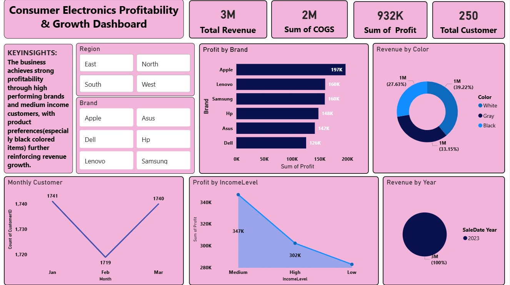

# 📊 Consumer Electronics Profitability & Growth Dashboard

#Dashboard Preview

## 📌 Overview
This project presents an interactive Power BI dashboard designed to analyze revenue performance, cost structure, and profitability drivers within the consumer electronics sector.

The dashboard enables dynamic exploration of key business metrics across regions, brands, and customer segments.

---

## 🎯 Objectives
- Analyze revenue, cost (COGS), and profit performance
- Identify top-performing brands and products
- Understand customer segmentation by income level
- Highlight key business drivers for profitability

---

## 📊 Key Insights
- Apple is the leading profit-generating brand
- Medium-income customers contribute the highest share of profit
- Costs account for a significant portion of revenue, indicating optimization opportunities
- Product preferences (e.g., color) influence revenue trends
- Customer activity remains stable across months

---

## 🛠 Tools & Skills Applied
- Power BI
- Data Modeling
- DAX (Data Analysis Expressions)
- Data Visualization
- Business Insight Generation

---

## 📁 Project Files
- consumer-electronics-dashboard.pbix → Interactive Power BI dashboard
- dashboard-preview.png → Dashboard screenshot

---

## 🚀 Key Takeaway
This project demonstrates my ability to transform raw data into actionable insights and design dashboards that support data-driven decision-making.
